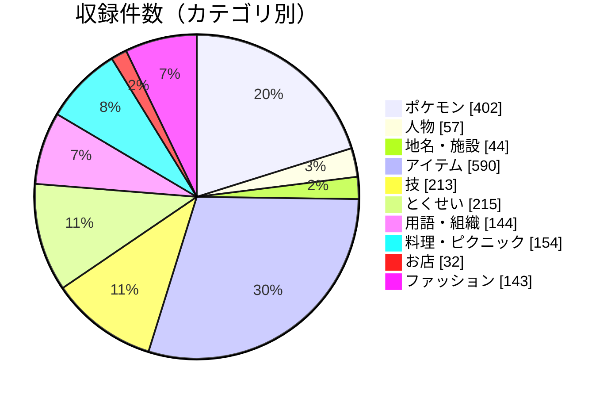

# 収録状況

> `node tools/coverage.js` でデータから自動生成しています（最終生成：2026-09-28）。
> 件数だけを載せていて、ネタバレになる名前は書いていません。
> このアプリは作者の推測をまとめたベストエフォートの図鑑で、ゲームのすべての言葉を網羅することを保証するものではありません。

収録件数：**1994 件**（追加コンテンツ「ゼロの秘宝」と、ほかの作品・ポケモン HOME・配信が必要なものは対象外）

## カテゴリごとの件数

| カテゴリ         | 件数 |                            |
| ---------------- | ---: | -------------------------- |
| ポケモン         |  402 | `████████████████`         |
| 人物             |   57 | `██`                       |
| 地名・施設       |   44 | `██`                       |
| アイテム         |  590 | `████████████████████████` |
| 技               |  213 | `█████████`                |
| とくせい         |  215 | `█████████`                |
| 用語・組織       |  144 | `██████`                   |
| 料理・ピクニック |  154 | `██████`                   |
| お店             |   32 | `█`                        |
| ファッション     |  143 | `██████`                   |

## 小分類ごとの件数

**人物**：主人公・ライバル 5／博士 2／ジムリーダー 8／ポケモンリーグ 4／スター団 6／アカデミーの先生 8／そのほかの人物 1／トレーナーの種類 23

**アイテム**：ボール 23／回復・飲み物 25／育成（ドーピング・アメ・ミント） 45／バトル用の使い捨て道具 10／持ち物（バトル用） 81／タイプの技を強くする持ち物 20／進化・姿を変える道具 27／テラスタル・テラピース 20／きのみ 53／お宝（売るための道具） 16／大切なもの 10／ピクニック用品 80／ポケモンの落とし物 180

**技**：第 9 世代で登場した技 48／わざマシンの技 165

**とくせい**：第 9 世代で登場したとくせい 31／第 8 世代までに登場したとくせい 184

**用語・組織**：ゲームのしくみ（システム） 36／せいかく（25 種） 25／リボン・あかし・二つ名 54／物語・組織・場所の言葉 29

**料理・ピクニック**：サンドウィッチのレシピ 37／サンドウィッチの材料・調味料 57／お店のメニュー 58／ピクニック・食事 2

**ファッション**：ブランド 14／制服・上下 5／ヘッドウェア 24／アイウェア 13／グローブ 6／バッグ 5／レッグウェア 14／シューズ 9／スマホロトムのカバー 53

## 主な内訳

作者が決めた対象範囲ごとの件数です（範囲の決め方は下の「対象範囲の決め方」）。

| 分野         | 内訳                                                       | 件数 |
| ------------ | ---------------------------------------------------------- | ---: |
| ポケモン     | パルデア図鑑（本編 400 種）                                |  400 |
| ポケモン     | スカーレット・バイオレット初登場（No.906〜1008）           |  103 |
| ポケモン     | パルデア図鑑にないが本編で手に入るポケモン（交換・もらう） |    2 |
| ポケモン     | パラドックスポケモン（本編）                               |   16 |
| わざマシン   | わざマシン（本編 No.001〜171）                             |  171 |
| 技           | わざマシンの技のうち、第 1〜8 世代からある技               |  165 |
| 技           | 第 9 世代で登場した技（本編。スターモービルの技を含む）    |   48 |
| アイテム     | 第 9 世代で登場した持ち物（バトル用）                      |    8 |
| アイテム     | 第 9 世代で登場した進化用の道具                            |    4 |
| アイテム     | 本編のバッグに入る道具すべて（わざマシンを除く）           |  646 |
| アイテム     | ポケモンの落とし物（わざマシンの材料）                     |  181 |
| とくせい     | 本編のポケモンが持つとくせいすべて（隠れ特性を含む）       |  215 |
| とくせい     | そのうち第 9 世代で登場したとくせい                        |   31 |
| 用語         | せいかく                                                   |   25 |
| 人物         | ジムリーダー                                               |    8 |
| 人物         | ポケモンリーグ（四天王・トップ）                           |    5 |
| 人物         | スター団のボス（5 人＋カシオペア）                         |    6 |
| 人物         | アカデミーの先生（校長・保健室を含む）                     |    9 |
| 人物         | トレーナーの種類（本編のパルデアで勝負するもの）           |   23 |
| 用語         | あかし（本編で付くもの）                                   |   47 |
| 用語         | リボン（本編でもらえるもの）                               |    4 |
| 地名         | 町・都市                                                   |   12 |
| 地名         | パルデア十景                                               |   10 |
| 地名         | 災厄のポケモンの祠                                         |    4 |
| お店         | お店・飲食店（本編のチェーン店と専門店）                   |   32 |
| お店         | 出店先の町が分かるお店（フレンドリィショップを除く）       |   31 |
| 料理         | サンドウィッチのレシピ（系統）                             |   37 |
| 料理         | 飲食店のメニュー（本編。寿司のセットはまとめて数える）     |   58 |
| 料理         | 食事パワーが分かるメニュー                                 |   58 |
| 料理         | レシピと食事パワーが分かるサンドウィッチの系統             |   37 |
| 料理         | サンドウィッチの材料・調味料                               |   58 |
| ファッション | ファッションブランド                                       |   14 |
| ファッション | 服・小物・スマホロトムのカバー（本編で手に入るもの）       |  129 |

## ネタバレ段階ごとの件数

| カテゴリ         |    序盤 |     本編 |   終盤 | クリア後 |
| ---------------- | ------: | -------: | -----: | -------: |
| ポケモン         |     111 |      267 |     10 |       14 |
| 人物             |      33 |       18 |      3 |        3 |
| 地名・施設       |      12 |       25 |      6 |        1 |
| アイテム         |     255 |      324 |     10 |        1 |
| 技               |      61 |      145 |      7 |        — |
| とくせい         |     118 |       86 |      9 |        2 |
| 用語・組織       |     118 |       21 |      4 |        1 |
| 料理・ピクニック |      53 |      100 |      1 |        — |
| お店             |       9 |       23 |      — |        — |
| ファッション     |      10 |      133 |      — |        — |
| **合計**         | **780** | **1142** | **50** |   **22** |

- **序盤**：ゲーム開始〜テーブルシティ・アカデミー入学のころまでに分かる情報
- **本編**：3 つのストーリー（ジム・スター団・ヌシ）の道中で出会うポケモン・人物・技
- **終盤**：各ストーリーの終盤、チャンピオンテスト・ポケモンリーグ、伝説・災厄のポケモン
- **クリア後**：エンディング以降の物語、エリアゼロ、パラドックスポケモン

## 推測について

| 確からしさ | 意味                                   | 件数 |
| ---------- | -------------------------------------- | ---: |
| ★★★        | 綴りや語の対応がはっきりしている       | 1820 |
| ★★         | 意味や図鑑の説明と合う、よく言われる説 |  166 |
| ★          | 根拠が弱い、または由来がはっきりしない |    8 |

- 由来の説を複数並べている名前：**398 件**
- 「分からないこと」（裏取りできなかった点）を書いている名前：**8 件**
- 進化の系統を載せているポケモン：**341 種**／姿・フォルムを載せているポケモン：**30 種**

## 対象範囲の決め方

- **ポケモン**：本編のパルデア図鑑 400 種と、図鑑にはないが本編の交換・プレゼントで手に入るポケモン（ヌオー・ニャイキング）。
- **わざマシン**：本編のわざマシン No.001〜171（No.172 以降は追加コンテンツ）。技はわざマシンの技と、本編で登場した第 9 世代の技（スターモービル専用の技を含む）。
- **とくせい**：本編のポケモンが持つとくせい（隠れ特性を含む）。
- **アイテム**：本編（Ver.1.0.0）でバッグに入る道具（わざマシンを除く）。Bulbapedia の第 9 世代の道具の一覧から、追加コンテンツで増えたものと、ほかの作品・ポケモン HOME・配信がないと手に入らない道具を除いています。
- **人物**：主な登場人物と、本編のパルデアで勝負するトレーナーの種類。
- **地名・お店・料理・ファッション**：本編で行ける場所・お店と、そこで出会う料理・服（追加コンテンツ、ほかの作品のセーブデータ連動、配信で手に入るものは除く）。寿司のセットはまとめて数えています。
- **用語**：ゲームのしくみ、せいかく、リボン・あかし・二つ名、物語・組織の言葉。
